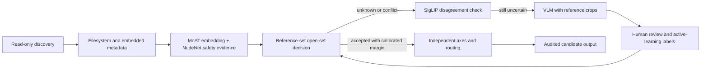

# Architecture

`image-curator` is an Alpha set of read-only primitives for a large, messy image library. The intended pipeline is staged so that inexpensive evidence is collected before expensive inference, and every stage can stop with `unknown` or `review`.

## Processing flow

The diagram describes the target operating model. The Alpha package currently implements the read-only scanner, duplicate occurrence tracking, checkpoint store, resumable Pillow/adapter extraction, bounded technical evidence, resource planner, metadata evidence digest, an explicit user-supplied WD14 MoAT/NudeNet ONNX path, reference-set open-set classification, routing and threshold calibration. A caller supplies orchestration and adapters for SigLIP, VLM, and any model outside that local ONNX path.

## Stage contracts

| Stage | Evidence collected | Boundary and next action |
| --- | --- | --- |
| Discovery | Stable source snapshot, extension, size, timestamps and content hash | Never follows symlinks unless explicitly requested; a changed source is recorded as an error and not silently accepted. |
| Metadata and technical | Filesystem fields, embedded field keys/digest, dimensions, bounded luminance/entropy/clipping/edge statistics | Metadata and image statistics are evidence, not labels. Parsing failures remain visible, and technical thresholds require calibration. |
| MoAT + NudeNet | Compact embedding and safety-related detector evidence | MoAT similarity and NudeNet scores are signals. They do not decide identity or publishing value. |
| Reference-set open set | Top references, similarity, margin and calibrated acceptance state | A low margin, missing reference, conflicting evidence or out-of-distribution sample becomes `unknown`. |
| SigLIP disagreement | An independent semantic signal and disagreement reason | Disagreement is routed to review or the next expensive stage; it is never averaged away silently. |
| VLM reference-crop review | A caller-selected crop, a constrained question, answer, confidence and refusal/unknown state | VLM use is explicit and optional. Do not send a full library or sensitive metadata by default. |
| Human active learning | Confirmed label, reviewer rationale and calibration-set membership | Only explicit human labels may change the reference set or calibrate thresholds. |

## Resource-aware execution

The resource planner reads capacity visible to the process and chooses bounded workers, decode threads, batch size, prefetch, and pause thresholds. A production runner should persist the resource snapshot beside the run configuration and resume from the checkpoint. Check GPU utilization during startup or against a separate foreground-work queue; a running worker must not pause only because it observes its own GPU utilization. During a run, use free VRAM, RAM pressure and the foreground queue as the resource gates. Resource discovery must not change host configuration.

The checkpoint is a derived artifact in a separate output directory. Asset IDs are content hashes, and enqueueing is idempotent, so a retry or resume does not move or rewrite source files. Duplicate content is extracted once while every observed source path remains in the `occurrences` table. A deployment may add a derived index, but source mutation remains disabled until a separate, reviewed policy explicitly enables it.

## Evidence and failure states

Every stage should preserve its input snapshot, model/adapter identifier, configuration fingerprint, score, threshold version, and error or refusal state. The minimum terminal states are `accepted`, `review`, `unknown`, and `error`; an absent result is not an acceptance. Keep `safety`, `technical_quality`, `identity`, and `publish_value` in separate fields so that one concern cannot silently override another.

The package does not provide an automatic publish, delete, move or rename operation. Integrators should export a review queue and an auditable plan, then require a human decision before an external system performs any file operation.

## Optional model adapters

Model runtimes are optional and supplied by the caller. The package does not bundle or download weights. Before enabling an adapter, the operator must verify its model license, dataset terms, service terms, data-transfer behavior, and retention behavior. A `module:factory` adapter is trusted Python code with the process's file and network permissions; the protocol is a data contract, not a sandbox. A remote VLM connector must be an explicit opt-in with a documented crop, prompt, recipient and retention policy.
